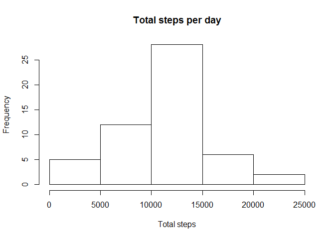
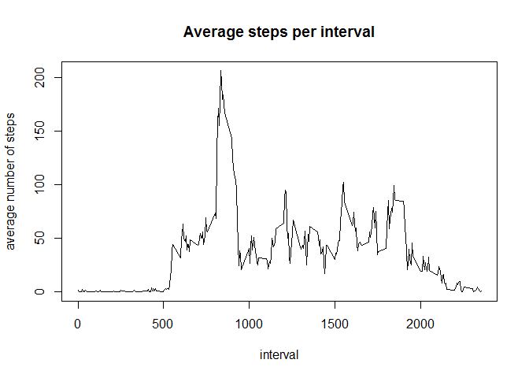
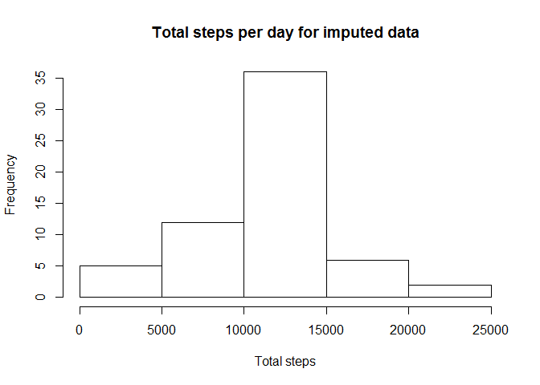
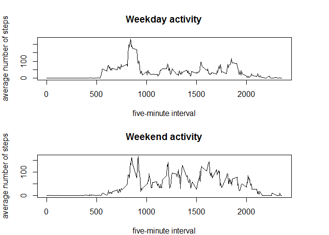

# Reproducible Research: Peer Assessment 1
### Kea Duckenfield
### 2 August 2017

## Loading required packages


```r
library(knitr)
library(dplyr)
```

```
## 
## Attaching package: 'dplyr'
```

```
## The following objects are masked from 'package:stats':
## 
##     filter, lag
```

```
## The following objects are masked from 'package:base':
## 
##     intersect, setdiff, setequal, union
```

## Loading and preprocessing the data
### Format dates correctly and make a factor variable for the day of the week.


```r
data <- read.csv("C:/Users/kea/Documents/coursera/rr/week1/RepData_PeerAssessment1/activity/activity.csv")
data$date <- as.Date(data$date)
data$weekday <- as.factor(weekdays(data$date))
```
## What is the mean total number of steps taken per day?
### In dplyr, group the data by date and sum the steps by date.

```r
data_dt<-tbl_df(data)
data_by_date<-group_by(data, date)
steps_per_day <- summarize(data_by_date, sum(steps))
```
### Find the mean and median, and plot a histogram of total steps by day.

```r
mean_steps <- mean(steps_per_day$`sum(steps)`, na.rm = TRUE)
print(mean_steps)
```

```
## [1] 10766.19
```

```r
median_steps <- median(steps_per_day$`sum(steps)`, na.rm = TRUE)
print(median_steps)
```

```
## [1] 10765
```

```r
hist(steps_per_day$`sum(steps)`, main = "Total steps per day", xlab = "Total steps")
```

<!-- -->
## What is the average daily activity pattern?
### In dplyr, group the data by interval, then find the average steps per interval.

```r
data_by_int <- group_by(data, interval)
mean_int <- summarize(data_by_int, avg_steps = mean(steps, na.rm = TRUE))
```

### Plot average steps versus interval to make a time series plot.

```r
with(mean_int, plot(interval, avg_steps, type = "l", main = "Average steps per interval", ylab = "average number of steps"))
```

<!-- -->

### Find the interval with the greatest average number of steps.

```r
mean_int$interval[which(mean_int$avg_steps == max(mean_int$avg_steps))]
```

```
## [1] 835
```
## Imputing missing values
### Find the number of observations with missing values for steps.

```r
sum(is.na(data$steps))
```

```
## [1] 2304
```
### Merge the data with the interval means table, then replace NA
### in any observation of steps with the average value for that interval.

```r
data_imputed <- merge(data, mean_int, by = "interval")
data_imputed$steps <- ifelse(!is.na(data_imputed$steps), data_imputed$steps, data_imputed$avg_steps)
imputed_dt <- tbl_df(data_imputed)
imputed_by_date <- group_by(imputed_dt, date)
imputed_steps_per_day <- summarize(imputed_by_date, sum(steps))
```
### Find the mean and median values for total steps per day.

```r
mean_imputed_steps <- mean(imputed_steps_per_day$`sum(steps)`)
print(mean_imputed_steps)
```

```
## [1] 10766.19
```

```r
median_imputed_steps <- median(imputed_steps_per_day$`sum(steps)`)
print(median_imputed_steps)
```

```
## [1] 10766.19
```
### Create a histogram of total steps per day.
### Assess the impact of imputing missing values to mean, median, and histogram.

```r
hist(imputed_steps_per_day$`sum(steps)`, main = "Total steps per day for imputed data", xlab = "Total steps")
```

<!-- -->

### The impact of imputing missing values using the means for intervals appears to be
### either negligible or none at the level of the whole dataset. The mean and median 
### values are the same, and the histograms appear similar. However, obviously, for
### days such as 1 October 2010, where many values are missing, imputing values 
### makes a substantial difference.

## Are there differences in activity patterns between weekdays and weekends?
### Add a new two-level factor variable to the data: weekday = 0, weekend = 1.

```r
imputed_dt$weekend <- ifelse(imputed_dt$weekday == "Saturday", 1, ifelse(imputed_dt$weekday == "Sunday", 1, 0))
imp_int_wkend <- group_by(imputed_dt, interval, weekend)
```
### Recalculate average steps per interval as a function of weekday or weekend
### using the imputed data set.

```r
imp_spd <- summarize(imp_int_wkend, mean_steps = mean(steps))
```
### Plot average steps per interval for weekdays versus weekends.

```r
par(mfrow = c(2,1))
par(mar = c(4,4,4,4))
with(imp_spd[imp_spd$weekend == 0,], plot(interval, mean_steps, type = "l", main = "Weekday activity", xlab = "five-minute interval", ylab = "average number of steps"))
with(imp_spd[imp_spd$weekend == 1,], plot(interval, mean_steps, type = "l", main = "Weekend activity", ylab = "average number of steps", xlab = "five-minute interval"))
```

<!-- -->
